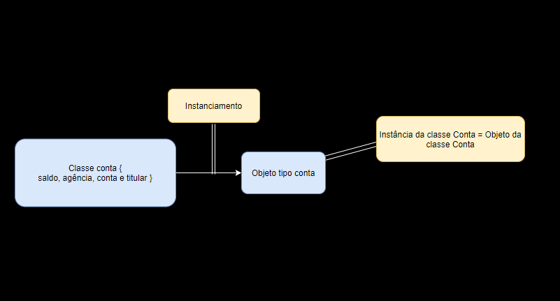

# Curso 2 (De 30/01/2021 a 09/02/2021 - Revisão)

## Java OO

### Especificando um objeto e criando ele

Nesse curso nós vamos fazer um banco chamado bytebank. Esse banco terá quatro atributos: saldo, conta, agência e titular. 

Antes de criar a conta, eu preciso criar as especificações dela: quais são as características e como será o funcionamento. 

Para isso, eu vou criar uma classe chamada ``Conta`` e colocar os atributos dela: 

```java
public class Conta {
    double saldo;
    int agencia;
    int conta;
    String titular;
}
```

Nessa classe eu não uso ``public static void main`` porque ele não será o ponto de partida da minha aplicação. Essa classe contém as regras que eu vou usar para criar contas em outras classes. São os atributos que um **objeto Conta** vai ter quando for criado. 

Os atributos nada mais são que **características da classe**, que também serão dos objetos do tipo ``Conta``.

Outros sinônimos para atributos nesse contexto são **campos** ou **propriedade**. 

Agora que eu tenho as minhas especificações, vou criar uma classe chamada ``CriaConta`` para criar um objeto Conta.

Para criar esse objeto, eu tenho que declarar uma variável do tipo ``Conta`` e depois do ``=`` eu tenho que usar o ``new Conta()``. Fica assim: 

```java
public class CriaConta {
    public static void main(String[] args) {
        Conta primeiraConta = new Conta();
    }
}
```

Agora eu quero colocar um valor no saldo dessa minha conta, então vou fazer assim: 

```java
public class CriaConta {
    public static void main(String[] args) {
        Conta primeiraConta = new Conta();
        primeiraConta.saldo = 200.0;
    }
}
```

O ``.`` é forma que eu uso para navegar entre os atributos da minha classe. 

Quando a gente declara uma variável para criar um objeto, nós não estamos armazenando o objeto em si na variável, e sim apenas apontando para ela na memória. O conceito é parecido com o de ponteiro no C. 

Um objeto pode ser chamado de **instância**, e o processo de criar um objeto pode ser chamado de **instanciar**. 



### Valores padrão

Antes, quando declarávamos uma variável e não era atribuido nenhum valor à ela, o Eclipse indicava um erro de compilação pois a variável não havia sido inicializada. 

Agora, quando criamos uma classe, podemos atribuir alguns valores padrões para cada atributo. Mesmo se não fizermos isso deliberadamente, quando criarmos um objeto, o Java zera todos os valores dos atributos. Então se printarmos o saldo de um objeto tipo conta que ainda não teve um saldo definido, o valor que receberemos será ``0``.

### Métodos

Agora que já definimos quais são os atributos da classe ``Conta``, temos que definir quais serão seus comportamentos e como eles serão executados. 

Para isso, criaremos três métodos para alterar o saldo: deposita, saca e transfere. 

```java
public class Conta {
    // Atributos

    public void deposita(double valor) {
        this.saldo += valor;
    }

    public boolean saca(double valor) {
        if(this.saldo >= valor) {
            this.saldo -= valor;
            return true;
        }
        return false;
    }

    public boolean transfere(double valor, Conta destino) {
        if(this.saldo >= valor) {
            this.saldo -= valor;
            destino.deposita(valor);
            return true;    
        }
        return false;
    }

}
```

O método ``deposita`` foi declarado como ``public void``. O ``public`` indica que saca será visível para todas as classes, e o ``void`` que não haverá nenhum retorno após a execução. 

Entre os parênteses declaramos uma variável que vamos precisar receber sempre que esse método for utilizado. Essa variável é chamada de parâmetro. 

Dentro das chaves definimos como o saldo será alterado. 

Usamos o this para especificar que o saldo que será alterado é do objeto declarado. 

Obs.: é boa prática declarar o nome do método com a primeira letra minúscula, e se houver mais de uma palavra, utilizar o ``camelCase``. 

```java
//  Classe 

Conta conta = new Conta();
conta.deposita(100);
```

Então, parecido quando vamos mexer em um atributo do objeto, nós invocamos o método com a ``referencia.método``.

Os métodos saca e transfere são parecidos. Dessa vez teremos um retorno, por isso declaramos como ``public boolean``. Definimos os argumentos que eles receberão e depois como farão a ação. 

### Composição de objetos

Vamos supor que a partir de agora, queremos saber o nome completo, CPF e profissão do titular da conta do bytebank. Nós podemos adicionar esses atributos na nossa classe Conta, conforme abaixo: 

```java
public class Conta {
    // saldo, agência, conta e titular

    String nome;
    String cpf;
    String profissao;

    // Métodos depositar, sacar e transferir
}
```

Por mais que possa parecer que faz sentido ter essas informações na conta, podemos criar uma classe chamada ``Cliente`` e incluir esses atributos. 

```java
public class Cliente {
    String nome;
    String cpf;
    String profissao;
}
```

Como os atributos da classe ``Cliente`` são informações que queremos do titular, nós podemos fazer uma referência à essa classe indicando que ``titular`` é do tipo ``Cliente``.

```java
public class Conta {
    double saldo;
    int agencia;
    int conta;
    Cliente titular;

    // Métodos
}
```

Agora podemos criar um objeto do tipo ``Cliente`` e depois atribuir ao titular da conta. Assim:

```java
public class TestaConta {
    public static void main(String[] args) {
        Cliente luiz = new Cliente();
        luiz.nome = "Luiz Medeiros";
        luiz.cpf = "222.222.222-22";
        luiz.profissao = "Programador";

        Conta contaDoLuiz = new Conta();
        contaDoLuiz.titular = luiz;
    }
}
```

Podemos fazer isso de um jeito melhor também (claro).

```java
public class TestaConta {
    public static void main(String[] args) {
        Conta contaDoLuiz = new Conta();
        contaDoLuiz.titular = new Cliente();
    }
}
```

Assim eu consigo já instanciar ``Cliente`` e se quiser, posso acessar diretamente um atributo da classe.

```java
public class TestaConta {
    public static void main(String[] args) {
        Conta contaDoLuiz = new Conta();
        contaDoLuiz.titular = new Cliente();

        contaDoLuiz.titular.nome = "Luiz Medeiros";
    }
}
```

Caso houver a necessidade, nós podemos criar um objeto ``Cliente`` toda vez que uma ``Conta`` for instanciada.

```java
public class Conta {
    double saldo;
    int agencia;
    int conta;
    Cliente titular = new Cliente();

    // Métodos
}
```

A separação de atributos em várias classes é, além de normal em liguagens OO, é também uma boa prática. 

### Encapsulamento

Quando definimos os nossos métodos ``saca``, ``transfere`` e ``deposita``, inserimos uma lógica para que o ``saldo`` nunca ficasse negativo, mas isso pode ser facilmente contornado quando acessamos diretamente o atríbuto.   

Para impedir que isso ocorra, usaremos a palavra chave ``private`` para **encapsular** os nossos atributos. Ficaria assim: 

```java
public class Conta {
    private double saldo;
    private int agencia;
    private int conta;
    private Cliente titular = new Cliente();

    // Métodos
}
```

Dessa forma, para inserir algum valor no saldo, por exemplo, vamos ter que usar obrigatóriamente um dos métodos que a gente criou.

### Getters e Setters

Agora que encapsulamos tudo, nós precisamos criar os métodos para acessar os atributos ``agência``, ``conta`` e ``titular``. Em Java é usado a nomenclatura **Getter** para verificar o valor e **Setter** para definir. Esses termos são utilizados nos nomes dos métodos. Assim: 

```java
public class Conta {
    // Atributos

    // Outros métodos

    public int getAgencia() {
        return this.agencia;
    }

    public void setAgencia(int agencia) {
        this.agencia = agencia;
    }

    public int getConta() {
        return this.conta;
    }

    public void setConta(int conta) {
        this.conta = conta;
    }

    public String getTitular() {
        return this.titular;
    }

    public void setTitular(String titular) {
        this.titular = titular;
    }
}
```

### Construtores

Em alguns cenários, queremos que um objeto sempre tenha algumas informações. No nosso caso, queremos que toda conta tenha agência e conta. Para fazer isso, vamos criar um construtor na classe Conta. 

O Java já nos dá um construtor padrão quando criamos uma classe. Mas a partir do momento que criamos um, aquele construtor padrão não pode ser mais utilizado. 

```java
public class Conta {
    // Atributos

	public Conta(int agencia, int conta) {
		if(agencia >= 0 && conta >= 0) {
			this.agencia = agencia;
			this.conta = conta;
		} return;
	
    // Métodos
}
```

Colocamos uma validação para que não seja cadastrada nenhuma agência ou conta com número negativo. 

Agora, toda vez que um objeto ``Conta`` for criado, será necessário informar uma número para ``agencia`` e ``conta``.

É possível também criar mais de um construtor na classe. Se tivermos alguma validção em um dos construtores, podemos usar o ``this()`` para utilizar em outro construtor, sem a necessidade de reescrever.

#### Static

Se quisermos saber quantas contas já foram instanciadas, precisamos declarar uma variável que vai fazer essa contagem. Então vamos declarar ela como um atributo da classe ``Conta``. 

```java
public class Conta {
    // Atributos
    private static int total;

    // Métodos
}
```

A palavra chave ``static`` transforma a variável ``total`` em um atributo da classe e não do objeto. 

Por exemplo: quando criamos uma conta e definimos um saldo, aquele valor vale para aquela conta, por isso usamos o ``this`` nos métodos de saca, deposita e transfere. Já no caso do total, esse valor não é de um objeto especifico, e sim da classe como um todo. É tipo uma variável global.

Agora, vamos completar o nosso construtor: 

```java
	public Conta(int agencia, int conta) {
		Conta.total++;
		System.out.println("O total de contas é " + Conta.total);
		if(agencia >= 0 && conta >= 0) {
			this.agencia = agencia;
			this.conta = conta;
		} return;
```