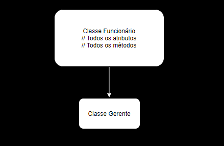
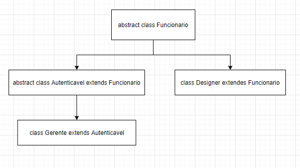

# Curso 2 (De 10/02/2021 a ????)

## Contexto

Nesse curso, vamos criar uma classe chamada ``Funcionario`` que é quase idêntica a classe ``Cliente`` que criamos no curso anterior. O código dessa classe segue abaixo: 

```java
public class Funcionario {
	private String nome;
	private String cpf;
	protected double salario;
	
	public double getBonificacao() {
		return this.salario * 0.1;
	}
	
	public String getNome() {
		return nome;
	}
	public void setNome(String nome) {
		this.nome = nome;
	}
	public String getCpf() {
		return cpf;
	}
	public void setCpf(String cpf) {
		this.cpf = cpf;
	}
	public double getSalario() {
		return salario;
	}
	public void setSalario(double salario) {
		this.salario = salario;
	}
	
}
```

### Extends

Se quisermos criar uma classe ``Gerente``, que tenha as mesmas características de ``Funcionario``, mas somente com um novo atributo e uma bonificação diferente, nós podemos usar o comando ``extends``.

A classe Gerente ficaria assim: 

```java
public class Gerente extends Funcionario {
	private int senha;
	
	public void setSenha(int senha) {
		this.senha = senha; 
	}
	
	public boolean autentica(int senha) {
		if (this.senha == senha) {
			return true;
		} else {
			return false;
		}
	}
	
	 public double getBonificacao() {
		return this.salario;
	}
	
}
```

Inserimos também um método de autenticação da senha e outro para setar a senha. 

Quando usamos o ``extends``, podemos dizer que ``Gerente`` herdou atributos e métodos de ``Funcionario``. 

### Super class

Super class, classe mãe, classe pai ou base class, é o nome que podemos dar para a classe no maior nível hierarquico. Podemos usar como exemplos as classes Funcionario e Gerente. A classe ``Funcionario`` é a classe pai e a ``Gerente`` é a classe filha. 



### Protected

Mesmo estendendo a classe ``Funcionario`` com a classe ``Gerente``, nós não conseguimos acessar o atributo ``saldo`` diretamente e consequentemente existe um erro no nosso método ``getBonificacao``. Temos duas opções para resolver esse problema: 

Uma das opções é alterar a visibilidade do atributo ``saldo`` para ``protected``. O ``protected`` dá visibilidade para a própria classe e suas filhas. No nosso caso, visibilidade para ``Funcionario`` e ``Gerente``. 

### Protected x Private 

A segunda opção é manter o saldo como ``private`` e utilizar o método ``getBonificacao`` da classe ``Funcionario`` no  ``getBonificacao`` da classe ``Gerente`` com o seguinte comando: ``super.getBonificacao``. Ficaria assim: 


```java
public class Gerente extends Funcionario {
    // Atributos
    // Métodos

	 public double getBonificacao() {
		return super.getBonificacao;
	}
	
}
```

Aqui estamos usando a palavra chave ``super`` para acessar a classe ``Funcionario`` e usar o método ``getBonificacao``. Assim conseguimos manter o atributo encapsulado e usar o método que já criamos.

### Sobrescrita (Override) x Sobrecarga (Overload)

**Sobrescrita** é o que fizemos com o ``getBonificacao``: temos um método mais geral para o ``Funcionario``, e criamos um mais específico para o ``Gerente``. Então sobrescrita é reescrever um método que já existe na classe mãe, só que na classe filha, para atender uma necessidade mais específica. Segue exemplo: 

**getBonificacao Funcionario**

```java
public class Funcionario {
    // Atributos
	
	public double getBonificacao() {
		return this.salario * 0.1;
	}
	
    // Métodos
	
}
```

**getBonificacao Gerente**

```java
public class Gerente extends Funcionario {
    // Atributos
    // Métodos

	 public double getBonificacao() {
		return super.getBonificacao;
	}
	
}
```

**Sobrecarga** é a escrita de um método que já existe na classe, mas com parâmetros e comportamentos diferentes. Como no exemplo abaixo, que temos dois métodos ``autentica``: um que recebe somente a senha como parâmetro e outro que recebe login e senha. 

**Exemplo 1:** 

```java
public boolean autentica(int senha) {
    if (this.senha == senha) {
        return true;
    } else {
        return false;
    }
}
```

**Exemplo 2:**

```java
public boolean autentica(String login, int senha) {
	if (this.senha == senha && this.login == login) {
		return true;
	} else {
		return false;
	}
	
}
```

### Polimorfismo

Com o polimorfismo nós conseguimos usar referências mais genéricas apontarem para objetos específicos. Agora queremos saber quanto pagamos de bonificação aos funcionários, e para isso, criaremos uma classe chamada ``ControleBonificacao``.

```java
public class ControleBonificacao {
	private double soma;

	public void registro(Funcionario f) {
		double boni = f.getBonificacao();
		this.soma += boni;
	}

	public double getSoma() {
		return this.soma;
	}
}
```

Também vamos criar mais um tipo de funcionário chamado ``Designer``.

```java
public class Designer extends Funcionario {
	public double getBonificacao() {
		System.out.println("Bonificação designer");
		return 200;
	}
}
```

Agora vamos criar outra classe chamada ``TestaReferencia`` para começar a contabilizar as bonificações. 


```java
public class TestaReferencia {
	public static void main(String[] args) {
		Gerente g1 = new Gerente();
		g1.setNome("Marcos");
		g1.setSalario(5000.0);
		
		Funcionario f = new Funcionario();
		f.setSalario(2000.00);
		
		Designer d = new Designer();
		d.setSalario(3500.0);
		
		ControleBonificacao controle = new ControleBonificacao();
		controle.registro(g1);
		controle.registro(f);
		controle.registro(d);
		
		System.out.println(controle.getSoma());
	}
}
```

Nessa classe declaramos três funcionários: ``g1 (Gerente)``, ``f (Funcionário)`` e ``d (Designer)``, e setamos o salário para cada um deles. Depois de definir os salários, criamos um objeto do tipo ``ControleBonificacao`` para fazer a soma dos valores, chamamos o método ``registro`` e passamos como argumento os funcionários. 

Após tudo isso, chamamos o ``getSoma`` dentro de um ``sysout``, e o resultado foi ``5550.0``, que é a soma de todas as bonificações. 

A vantagem e o objetivo do polimorfismo é usar uma referência genérica para apontar para um objeto específico. O método ``registro``, por exemplo, usa um argumento do tipo ``Funcionario``, que é a nossa classe mãe. Como todo objeto instanciado dentro de ``TestaReferencia`` é um funcionário, é possível fazer a soma de todas as bonificações. E isso ocorre porque o Java, nesses casos, sempre olha para o objeto e não para o tipo. 

### Herança e construtores

Voltamos a usar as classes ``Conta`` e ``Cliente`` que tinhamos criado no curso com o Paulo. 

**Classe Conta**

```java
public class Conta {
	private double saldo; 
	private int agencia;
	private int conta;
	private Cliente titular; 
	private static int total;


	// Construtor
	public Conta(int agencia, int conta) {
		Conta.total++;
		System.out.println("O total de contas é " + Conta.total);
		if(agencia >= 0 && conta >= 0) {
			this.agencia = agencia;
			this.conta = conta;
		} return;
	}
	
	// Método deposita, saca e transfere

	// Getters e setters
}
```

**Classe Cliente**

```java
public class Cliente {
	private String nome;
	private String cpf;
	private String profissao;
	
	// Getters e setters	
}
```

Queremos criar mais duas classes agora: ``ContaCorrente`` e ``ContaPoupanca``. Ambas serão filhas da classe ``Conta``. 

Quando criamos essas classes e usamos o ``extends Conta``, o Eclipse acusa um erro de compilação, informando que o construtor padrão da super class não foi definido. 

Durante o curso com o Paulo, criamos um construtor específico para a classe ``Conta`` para que os atributos ``agencia`` e ``conta`` fossem definidos todas vez que um objeto tipo ``Conta`` fosse instanciado. E quando criamos um construtor, o padrão que o Java disponibiliza pra gente não pode ser mais utilizado. 

Quando estendemos uma classe, a classe filha herda somente os **atributos** e **métodos**, mas mesmo assim o Java tenta acessar o construtor padrão da super class. Como não estamos mais usando esse construtor padrão, podemos resolver esse problema de duas formas: 

**Opção 1:**

Podemos criar um construtor padrão na classe ``Conta``. Com essa opção, nós podemos chamar esse padrão na classe filha ou simplesmente não chamar nada. 

```java
public class Conta {
	private double saldo; 
	private int agencia;
	private int conta;
	private Cliente titular; 
	private static int total;

	// Construtor padrão
	public Conta(){
		// Comportamento
	}

	// Construtor específico
	public Conta(int agencia, int conta) {
		Conta.total++;
		System.out.println("O total de contas é " + Conta.total);
		if(agencia >= 0 && conta >= 0) {
			this.agencia = agencia;
			this.conta = conta;
		} return;
	}
	
	// Método deposita, saca e transfere

	// Getters e setters
}
```

**Criando o construtor padrão na classe filha**

```java
public class ContaCorrente extends Conta {
	
	public ContaCorrente() {
		super();
	}

}
```

**Não criando construtor**

```java
public class ContaCorrente extends Conta{
	

}
```

**Opção 2:**

Podemos não criar um construtor padrão em ``Conta``, e chamar o construtor específico dentro da classe filha.

```java
public class Conta {
	private double saldo; 
	private int agencia;
	private int conta;
	private Cliente titular; 
	private static int total;

	// Construtor específico
	public Conta(int agencia, int conta) {
		Conta.total++;
		System.out.println("O total de contas é " + Conta.total);
		if(agencia >= 0 && conta >= 0) {
			this.agencia = agencia;
			this.conta = conta;
		} return;
	}
	
	// Método deposita, saca e transfere

	// Getters e setters
}
```

```java
public class ContaCorrente extends Conta{
	
	public ContaCorrente(int agencia, int conta) {
		super(agencia, conta);
	}

}
```

### Classes Abstratas

Quando temos uma classe que ele não deve ser necessariamente instanciada, mas somente servir como base para suas filhas, podemos definir essa clase como ``abstract``.

Podemos usar como exemplo a nossa classe ``Funcionario`` no projeto **bytebank-herdado**. 

Dificilmente temos uma pessoa dentro de uma empresa que ela só é um funcionário, normalmente ela tem uma função, é uma gerente, designer, programador e etc. Então, como uma pessoa sempre tem um papel dentro da empresa, a gente precisa somente da ideia ``Funcionario``, com os seus atributos e métodos. Não queremos que essa classe seja instanciada, visto que já temos classes específicas para cada tipo de colaborador. 

Para transformar uma classe em abstrata, inserimos a palavra chave abstract. Assim:

```java
public abstract class Funcionario {
 // Atributos
 // Métodos
}
```

Então, uma classe abstrada nada mais é do que uma classe normal, mas que não pode ser instanciada. 

### Métodos abstrados

Quando queremos somente a ideia de um método, para depois fazer uma implementação para cada cenário específico, nós também podemos criar um método abstrato. Ficaria assim: 

```java
public abstract class Funcionario {
	// Atributos
	
	// Método abstrato
	public abstract double getBonificacao();
	
	// Métodos
}

```
O método abstrato precisa estar dentro de uma classe abstrata e não precisa de implentação, ou seja, do corpo entre chaves. 

Obs.: Assinatura: (visibilidade, retorno, nome do método e parâmetros).

### TODO: resumo sobre mais de uma classe abstrata e sobre interface 

### Aumentando a hierarquia com classes abstratas 

É possível aumentar a hierarquia criando uma segunda classe abstrata que já estende outra classe abstrata. 

Isso é útil para quando queremos dar funções iguais para alguns funcionários e para outros não. Vamos supor que queremos que somente o Gerente e o Administrador tenham uma senha e a autenticação dessa senha e o Designer não. 

Classe abstrata que estende Funcionario e possui senha e um método abstrato chamado autentica.

```java
public abstract class Autenticavel extends Funcionario {
	private int senha; 
	public void setSenha(int senha);
	public boolean autentica(int senha);
}
```

Classe gerente estendendo Autenticavel. Aqui podemos dizer que Gerente é Autenticavel e Funcionario.

```java
public class Gerente extends Autenticavel {
	private int senha;
	
	 @Override
	 public double getBonificacao() {
		 System.out.println("Bonificação do gerente");
		return super.getSalario();
	}
	@Override
	public void setSenha(int senha) {
		this.senha = senha;
		
	}
	@Override
	public boolean autentica(int senha) {
		if(this.senha == senha) {
			return true;
		} else {
			return false;
		}
	}
}
```
Classe Designer que estende diretamente Funcionario. 

```java
public class Designer extends Funcionario {
	public double getBonificacao() {
		System.out.println("Bonificação designer");
		return 200;
	}
}
```

Temos duas classes abstratas sendo estendidas: ``Funcionario`` sendo estendido por ``Autenticavel`` e ``Designer`` e ``Gerente`` estendendo ``Autenticavel`` e consequentemente ``Funcionario`` também. 

Abaixo temos uma ilustração do que está ocorrendo.




### Interface 

Também podemos usar interfaces para utilizar implementar métodos com comportamentos específicos. A vantagem da interface é que podemos assinar mais de uma dentro do objeto. Ficaria assim: 

Agora Autenticavel virou uma interface. 

public abstract interface Autenticavel  {
	public void setSenha(int senha);
	public boolean autentica(int senha);

}

E gerente está estendendo Funcionario e assinando Autenticavel

```java
public class Gerente extends Funcionario implements Autenticavel {
	private int senha;
	
	 @Override
	 public double getBonificacao() {
		 System.out.println("Bonificação do gerente");
		return super.getSalario();
	}
	@Override
	public void setSenha(int senha) {
		this.senha = senha;
		
	}
	@Override
	public boolean autentica(int senha) {
		if(this.senha == senha) {
			return true;
		} else {
			return false;
		}
	}
}
```


Interfaces sempre são abstratos, então não podem ser instanciados e também só podem ter métodos abstratos e públicos. Interfaces não tem atributos. Elas são usadas para definir regras que queremos implementar em outras classes. 

A classe que assina a interface tem a obrigação de implementar o método (inserir o comportamento dele dentro do corpo/entre chaves).