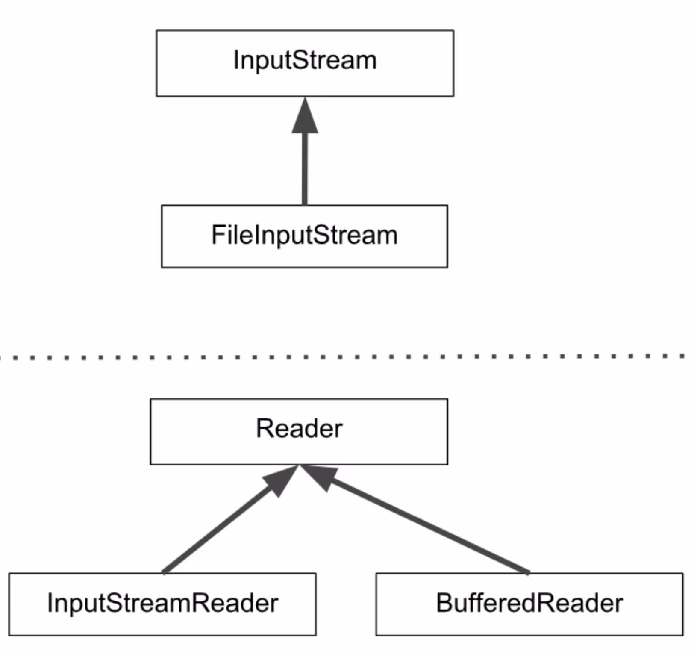

# Curso 7 (De 10/05/2021 a /2021)

## Java e java.io

### Input e output

O pacote java.io lida com entradas e saídas de informações. A entrada de informações pode vir de um servidor, como é o caso das aplicações web; de um arquivo, a gente pode usar o importador da lemon como um exemplo ou do teclado mesmo. 

### Lendo um arquivo

Nesse primeiro momento nós vamos fazer a leitura de um arquivo e exibir a primeira linha dele. O conteúdo do nosso arquivo está logo abaixo: 

```
Sed ut perspiciatis unde omnis iste natus error sit voluptatem accusantium doloremque laudantium, 
totam rem aperiam, eaque ipsa quae ab illo inventore veritatis et quasi architecto beatae vitae dicta sunt explicabo. 
Nemo enim ipsam voluptatem quia voluptas sit aspernatur aut odit aut fugit, 
sed quia consequuntur magni dolores eos qui ratione voluptatem sequi nesciunt. 
Neque porro quisquam est, qui dolorem ipsum quia dolor sit amet, consectetur,
adipisci velit, sed quia non numquam eius modi tempora incidunt ut labore et dolore magnam aliquam quaerat voluptatem. 
Ut enim ad minima veniam, quis nostrum exercitationem ullam corporis suscipit laboriosam, nisi ut aliquid ex ea commodi consequatur? 
Quis autem vel eum iure reprehenderit qui in ea voluptate velit esse quam nihil molestiae consequatur, 
vel illum qui dolorem eum fugiat quo voluptas nulla pariatur?
```

Primeiro, temos que definir o fluxo de entrada de informações através do arquivo, e para isso vamos utilizar a classe `FileInputStream`. O nosso código vai ficar assim. 

```java
import java.io.FileInputStream;
import java.io.FileNotFoundException;

public class TesteLeitura {

	public static void main(String[] args) throws FileNotFoundException {
		
		//Fluxo de entrada com um arquivo
		FileInputStream fis = new FileInputStream("lorem.txt");

	}

}
```

Nós criamos uma referência à classe `FileInputStream` chamada `fis`, depois usamos o **construtor que faz a leitura de uma string**, e inserimos o nome do arquivo como uma **string**. 

Para usar essa classe, o Eclipse gentilmente importou ela para gente com o trecho ``import java.io.FileInputStream``

Quando inserimos essa classe, o Eclipse nos da um alerta informando que a gente precisa tratar uma exceção, já que o compilador não pode garantir para gente que o arquivo que indicamos existe mesmo. Por isso demos um `throw` na exceção `FileNotFoundException`. O Eclipse também fez a gentileza de importar essa classe pra gente. 

Os metodos de leitura que temos com a classe `FileInputStream` não são adequados para o nosso objetivo, que é fazer a leitura do texto que está no arquivo, pois o método `read` da classe nos retorna um **int**.

Então vamos usar uma classe que faz a conversão de **int** para **char**. 

```java 
import java.io.FileInputStream;
import java.io.FileNotFoundException;
import java.io.InputStreamReader;

public class TesteLeitura {

        public static void main(String[] args) throws FileNotFoundException {

                //Fluxo de Entrada com Arquivo
                FileInputStream fis = new FileInputStream("lorem.txt");
                InputStreamReader isr = new InputStreamReader(fis);
        }
}
```

Temos uma referência à classe `InputStreamReader`, e com uma nova classe, tivemos que importar mais uma parte do pacote java.util. 

Com essa classe ainda não é possível alcançar o nosso objetivo, porque o método read da `InputStreamReader` também nos retorna uma **int**, mas dessa vez ela nos da o número de caracteres que foram lidos na linha. 

Agora sim vamos usar a classe que vai resolver os nossos problemas. 

```java 
import java.io.BufferedReader;
import java.io.FileInputStream;
import java.io.IOException;
import java.io.InputStreamReader;

public class TesteLeitura {

        public static void main(String[] args) throws IOException {

                //Fluxo de Entrada com Arquivo
                FileInputStream fis = new FileInputStream("lorem.txt");
                InputStreamReader isr = new InputStreamReader(fis);
                BufferedReader br =  new BufferedReader(isr);
        }
}
```

Com essa nova classe no código, tivemos que inserir mais duas partes do pacote java.util: `import java.io.BufferedReader` e `import java.io.IOException`. A primeira é a importação da classe `BufferedReader` que inclui um buffer para fazer a leitura. 

Um buffer nada mais é um do que um intermediário para fazer a leitura das informações. 

Depois tivemos que importar a `IOException`, para tratarmos a exceção que pode ocorrer na leitura do buffer. Como a FileNotFoundException estende a IOException, nós podemos fazer o `throws` na referência mais genérica, que é a `IOException`. Com isso, nós podemos apagar a importação da `FileNotFoundException`.

O que fizemos até aqui foi o seguinte: estabelecemos o fluxo de informações com o arquivo, depois transformamos os inteiros em caracteres, mas só a quantidade que foi lida e finalmente usamos o `BufferedReader` para fazer a leitura linha a linha do arquivo. 

O código final vai ficar assim: 

```java
package br.com.alura.java.io.teste;

import java.io.BufferedReader;
import java.io.FileInputStream;
import java.io.IOException;
import java.io.InputStreamReader;

public class TesteLeitura {

	public static void main(String[] args) throws IOException {
		
		//Fluxo de entrada com um arquivo
		FileInputStream fis = new FileInputStream("lorem.txt");
		InputStreamReader isr = new InputStreamReader(fis);
		BufferedReader br = new BufferedReader(isr);
		
		String linha = br.readLine();
		
		System.out.println(linha);
		
		br.close();
	}

}
```

Com o ``System.out.println`` nós conseguimos fazer a leitura de só uma linha.

Como estabelecemos uma entrada de informação, temos que estabecer o fim também. Para isso usamos o trecho `br.close()`.

O nosso output é: ``Sed ut perspiciatis unde omnis iste natus error sit voluptatem accusantium doloremque laudantium,``.

Da forma que fizemos a impressão da primeira linha está dentro de um padrão de desenvolvimento chamado **decorator**, pois conforme vamos avançando, vamos "decorando" a funcionalidade da classe anterior. Então `isr` decora o que `fis` faz e por sua vez `br` decora o que `isr` faz. 

Além disso, existe outro conceito por trás do que utilizamos. De forma geral, nós usamos classes que recebem o fluxo de informação e outras que fazer a leitura, **Input Stream** e **Readers** respectivamente. Com isso podemos advinhar que essas classes estão vindo de um lugar mais genérico, e isso é verdade, pois FileInputStream estende a classe **InputStream** e as classes **InputStreamReader** e **BufferedReader** estendem a classe **Reader**.



Para ler os restante das linhas vamos inserir um `while`. Nosso código vai ficar assim: 

```java
import java.io.BufferedReader;
import java.io.FileInputStream;
import java.io.IOException;
import java.io.InputStreamReader;

public class TesteLeitura {

	public static void main(String[] args) throws IOException {
		
		//Fluxo de entrada com um arquivo
		FileInputStream fis = new FileInputStream("lorem.txt");
		InputStreamReader isr = new InputStreamReader(fis);
		BufferedReader br = new BufferedReader(isr);
		
		String linha = br.readLine();
		
		while(linha != null) {
			System.out.println(linha);
			linha = br.readLine();
		}
		
		br.close();
	}

}
```

### Escrevendo em um arquivo

Dessa vez vamos fazer a escrita de um texto em um arquivo específico. O nosso código vai ficar bem parecido, só que ao invés de usarmos **Input Stream** e **Reader**, nós vamos usar **Output Stream** e **Writer**.

O nosso código vai ficar assim: 

```java
import java.io.BufferedWriter;
import java.io.FileOutputStream;
import java.io.IOException;
import java.io.OutputStream;
import java.io.OutputStreamWriter;
import java.io.Writer;

public class TesteEscrita {

	public static void main(String[] args) throws IOException {
		
		//Fluxo de entrada com um arquivo
		OutputStream fis = new FileOutputStream("lorem2.txt");
		Writer osw = new OutputStreamWriter(fis);
		BufferedWriter bw = new BufferedWriter(osw);
		
		bw.write("Sed ut perspiciatis unde omnis iste natus error sit voluptatem accusantium doloremque laudantium,");
		bw.newLine();
		bw.newLine();
		bw.write("totam rem aperiam, eaque ipsa quae ab illo inventore veritatis et quasi architecto beatae vitae dicta sunt explicabo.");
		
		bw.close();
	}

}
```

### Leitura e escrita

É possível fazer a leitura tanto de um arquivo, input no teclado ou de um servidor para depois escrever em um arquivo, printar no console ou ser um output em uma aplicação web. Abaixo segue um exemplo de como isso pode ser feito:

```java
import java.io.BufferedReader;
import java.io.BufferedWriter;
import java.io.FileInputStream;
import java.io.FileOutputStream;
import java.io.IOException;
import java.io.InputStream;
import java.io.InputStreamReader;
import java.io.OutputStream;
import java.io.OutputStreamWriter;
import java.net.Socket;

public class TesteLeituraEscrita {
	
	public static void main(String[] args) throws IOException {
		
		Socket s = new Socket();
		
		// Fluxo de entrada
		InputStream fis = s.getInputStream(); //System.in //new FileInputStream("dbz-intro.txt");
		InputStreamReader isr = new InputStreamReader(fis);
		BufferedReader br = new BufferedReader(isr);

		// Fluxo de escrita/saida
		OutputStream fus = s.getOutputStream(); //System.out //new FileOutputStream("dbz-intro-novo.txt");
		OutputStreamWriter osw = new OutputStreamWriter(fus);
		BufferedWriter bw = new BufferedWriter(osw);
		
		String line = br.readLine();

		while(line != null && !line.isEmpty()) {
			bw.write(line);
			bw.newLine();
			line = br.readLine();
		}
		
		br.close();
		bw.close();
		
	}
}
```
