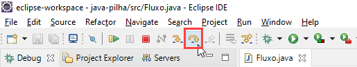
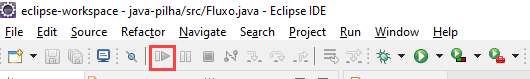
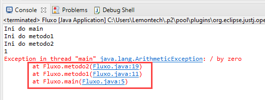
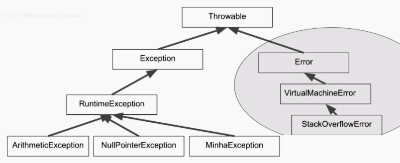

# Curso 4 (De 04/03/2021 a 13/03/2021)

## Exceções

### Pilha de execução

A pilha de execução nada mais é do que uma indicação do que está sendo executado e o que precisa ser executado. Tudo que está no topo da pilha, está sendo executado, e o que está abaixo, será executado ainda. 

Vamos entender como fica a pilha do código abaixo:

```java
	public static void main(String[] args) {
		System.out.println("Ini do main");
		metodo1();
		System.out.println("Fim do main");
	}

	private static void metodo1() {
		System.out.println("Ini do metodo1");
		metodo2();
		System.out.println("Fim do metodo1");
	}

	private static void metodo2() {
		System.out.println("Ini do metodo2");
		for (int i = 1; i <= 5; i++) {
			System.out.println(i);
		}
		System.out.println("Fim do metodo2");
	}
```

Em Java, assim com em C, o programa sempre será executado pelo método ``main``. Então, o primeiro item da pilha é o ``main``.


Dentro de ``main``, o ``metodo1`` é chamado, então o segundo item da pilha é o ``metodo1``.


Depois, chamamos o ``metodo2`` através do ``metodo1``. 


Quando o ``metodo2`` é finalizado, ele sai da pilha, deixando o ``metodo1`` no topo, que em seguida da lugar ao ``main``, e quando a o ``método main`` for finalizado, a pilha termina.

A linha do tempo da nossa pilha fica assim: 


O output do código que usamos como exemplo também ajuda a gente entender como a pilha funciona

```
Ini do main
Ini do metodo1
Ini do metodo2
1
2
3
4
5
Fim do metodo2
Fim do metodo1
Fim do main
```

### Debugando

O Eclipse oferece um recurso para fazer a depuração (debugar) do código. Funciona da seguinte forma: 

Primeiro colocamos um break point em uma linha. Neste caso vamos colocar na linha **4**.


Depois clicamos no inseto que fica ao lado esquerdo do play, vamos em **Debug As** e escolhemos a opção **Java Application**


Ao fazer isso, o Eclipse abre algumas views com informações da depuração. 


Para conseguir avançar, podemos usar a opção **Step Over** na parte de cima do Eclipse, ou usar o atalho **F6**. O **Step Over** avança para a próxima linha que será executada, que nesse caso é a linha **5**, que chama o ``metodo1``




Se usarmos o **Step Over** aqui, será executado todo o ``metodo1`` e consequentemente o ``metodo2`` e iremos para linha **6**, que tem o ``sysout``. Nós não queremos fazer isso agora. Queremos dar uma olhada dentro do ``metodo1``, e para isso, vamos usar **Step Into** ou **F5**.


Com esses dois comandos, conseguimos navegar pelo código para entender por ele passa. Se quisermos sair desse modo antes do código ser finalizado, podemos usar a função **Resume** ou **F8**.



### Exceções

Exceções são erros que aparecem no momento da execução do código, que possuem nomes explicativos. Exceções não são erros de compilação. Por mais que o programa esteja sintáticamente correto, pode ocorrer uma exceção no momento da execução.

As exeções também apresentam a pilha de execução. O código abaixo possui um erro na dentro do metodo2, que é a divisão por zero. 

```java
	public static void main(String[] args) {
		System.out.println("Ini do main");
		metodo1();
		System.out.println("Fim do main");
	}

	private static void metodo1() {
		System.out.println("Ini do metodo1");
		metodo2();
		System.out.println("Fim do metodo1");
	}

	private static void metodo2() {
		System.out.println("Ini do metodo2");
		for (int i = 1; i <= 5; i++) {
			System.out.println(i);
            int a = 10 / 0;
		}
		System.out.println("Fim do metodo2");
	}
```

Ao executar, recebemos a seguinte mensagem. Note que a pilha é exibida no erro. 



Isso ocorre porque quando a exceção ocorre, o compilador vai voltando no código para encontrar uma tratativa para esse erro. Então nesse caso ele voltou no ``metodo2`` mas não encontrou uma tratativa, depois no ``metodo1`` e por fim, no metodo ``main``. Como não existe nada para ajudar com essa exceção, o sistema é encerrado. 

Como o compilador começa ir atrás de várias informações nos métodos anteriores, o fluxo "natural" do programa é quebrado.

### try e catch

Podemos escrever o seguinte código para tratar uma exceção:

```java
	public static void main(String[] args) {
		System.out.println("Ini do main");
		metodo1();
		System.out.println("Fim do main");
	}

	private static void metodo1() {
		System.out.println("Ini do metodo1");
		metodo2();
		System.out.println("Fim do metodo1");
	}

	private static void metodo2() {
		System.out.println("Ini do metodo2");
		for (int i = 1; i <= 5; i++) {
			System.out.println(i);
            try {
                int a = 10 / 0;
            } catch(ArithmeticException ex) {
                System.out.println("ArithmeticException");
            }
		}
		System.out.println("Fim do metodo2");
	}
```

Veja que no output desse código, temos o ``sysout`` do ``catch`` a cada iteração do ``for``

```
Ini do main
Ini do metodo1
Ini do metodo2
1
ArithmeticException
2
ArithmeticException
3
ArithmeticException
4
ArithmeticException
5
ArithmeticException
Fim do metodo2
Fim do metodo1
Fim do main
```

Dentro do bloco ``try``, nós inserimos o código que tem potencial de ser problemático. E no ``catch``, inserimos uma referência do tipo da exceção que estamos esperando e depois o que queremos fazer caso essa exceção ocorra. 

```java
    try {
        int a = 10 / 0;
    } catch(ArithmeticException ex) {
        System.out.println("ArithmeticException");
    }
```

### Sobre a referência do catch

Quando usamos o try e catch, precisamos informar uma referência da exceção que esperamos para o catch, por exemplo: ``catch(ArithmeticException ex)``. Note que o padrão que ``ArithmeticException`` está escrito indica que ela é uma classe. Então dentro do parênteses do catch, estamos declando uma variável do tipo da exceção, nesse caso, do tipo ``ArithmeticException``.

Como é uma classe, nós podemos acessar alguns métodos dela. Seguem exemplos: 

**Exemplo 1:** ``getMessage()``

```java
public static void main(String[] args) {
    System.out.println("Ini do main");
    try {
        metodo1();
    } catch(ArithmeticException ex) {
        String msg = ex.getMessage();
        System.out.println("Exception " + msg);
    }
}
```
Output:

```
Ini do main
Ini do metodo1
Ini do metodo2
1
Exception / by zero
Fim do main
```

**Exemplo 2:** ``printStackTrace()``

```java
public static void main(String[] args) {
    System.out.println("Ini do main");
    try {
        metodo1();
    } catch(ArithmeticException ex) {
        String msg = ex.getMessage();
        System.out.println("Exception " + msg);
        ex.printStackTrace();
    }
}
```

Output: 

```
Ini do main
Ini do metodo1
Ini do metodo2
1
Exception / by zero
java.lang.ArithmeticException: / by zero
	at Fluxo.metodo2(Fluxo.java:25)
	at Fluxo.metodo1(Fluxo.java:17)
	at Fluxo.main(Fluxo.java:6)
Fim do main
```

Note que nos exemplos acima, inserimos coisas que já tinhamos visto na mensagem de exceção antes do tratamento. Exibimos a pilha ou uma parte da mensagem ou até a mensagem toda. 

Se tivermos mais de uma exceção para tratar, podemos colocar um ``|`` entre os tipos no parênteses do ``catch``, assim:

```java
public static void main(String[] args) {
    System.out.println("Ini do main");
    try {
        metodo1();
    } catch(ArithmeticException | NullPointerException ex) {
        String msg = ex.getMessage();
        System.out.println("Exception " + msg);
        ex.printStackTrace();
    }
}
```

### Lançando exceções

Se for necessário lançar uma exceção diretamente na pilha de execução, eu posso instanciar a exceção e depois lançá-la com o ``throw``.

**Opção 1:** usar uma referência para guardar a classe da exceção, nesse caso a ``ArithmeticException``.

```java
	private static void metodo2() {
		System.out.println("Ini do metodo2");
		
		ArithmeticException execption = new ArithmeticException("deu errado"); 
		throw execption;
	}
```

**Opção 2:** podemos lançar a exceção direto no instanciamento.

```java
	private static void metodo2() {
		System.out.println("Ini do metodo2");
		
		throw new ArithmeticException("deu errado"); 
	}
```

Esse comando funciona somente para exceções. Se quisermos lançar um objeto qualquer, por exemplo uma ``Conta``, o ``throw`` não irá funcionar. 

### Criando uma exceção

Quando criamos a referência ``ex`` do tipo ``ArithmeticException``, vimos que é possível utilizar alguns métodos, como ``printStackTrace`` ou ``getMessage``.

Se entrarmos nas definições de ``ArithmeticException``, veremos que ela estende uma classe chamada ``RuntimeException``, que por sua vez estende a classe ``Exception`` e que, por último, estende ``Throwable``.

Para criar uma exceção, teremos que estender ``RuntimeException``, para que a nossa exceção herde tudo o que tem no caminho até o ``Throwable`` (que eu confesso que não sei o que é).

**Exemplo de exceção:** 

```java
public class MinhaExcecao extends RuntimeException {
	public MinhaExcecao(String msg) {
		super(msg);
	}
}
```

Aqui estamos usando a herança de ``RuntimeException`` e criando um construtor que recebe uma ``string`` e que chama a mensagem na ``super class`` (classe acima ou classe mãe). No final do caminho desse super, vamos parar em Throwable, que tem a implementação original. 

**Implementação original massage:**

```java
    public Throwable(String message) {
        fillInStackTrace();
        detailMessage = message;
    }
```

Podemos usar a nossa exceção classe ``Fluxo``.

```java
	private static void metodo2() {
		System.out.println("Ini do metodo2");
		
		throw new MinhaExcecao("deu muito errado"); 
	}
```

### Sobre a hierarquia das classes de exceção

Tinhamos comentado acima que existe uma hierarquia nas classes de exceções, que vai de ``RuntimeException`` até ``Throwable``. Existe também um outro lado de ``Throwable`` que são as classes direcionas para os desenvolvedores da máquina virtual. Teoricamente, pode ser representado conforme abaixo: 



### Checked e Unchecked

As exceções são separadas em duas categorias: verificadas e não verificadas (checked e unchecked, respectivamente). As verificadas precisam de uma confirmação na assinatura do método para que o compilador permita a compilação. No caso das não verificadas, não existe a necessidade.

A garantia que temos que inserir na assinatura do método é ``throws NomeDaExcecao``. Por exemplo: 

**Definição da exceção:**

```java
public class MinhaExcecao extends Exception {
	public MinhaExcecao(String msg) {
		super(msg);
	}
}
```

**Exemplificação da garantia na assinatura:** 

```java
	private static void metodo2() throws MinhaExcecao{
		System.out.println("Ini do metodo2");
		
		throw new MinhaExcecao("deu muito errado"); 
	}
```

Note que na definição da exceção nós estendemos diretamente de ``Exception``. Então, quando a classe não estende ``RuntimeException``, ela precisa de uma verificação. 

Podemos também usar o ``try`` e ``catch`` para fazer a verificação.

```java
	private static void metodo2(){
		System.out.println("Ini do metodo2");
		
		try {
			throw new MinhaExcecao("deu muito errado"); 
		} catch (MinhaExcecao ex) {
			//Alguma coisa
		}
	}
```

Não existe diferença na excecução em si quando uma exceção é verificada ou não. 

### Catch genérico ou catch polimórfico 

Podemos fazer um catch que atende todas as exceções. Assim:

```java
public static void main(String[] args) {
    System.out.println("Ini do main");
    try {
        metodo1();
    } catch(Exception ex) {}
```

A opção acima não é uma boa prática. 

### Finally

Quando precisamos chamar algum método que fecha uma conexão com um banco de dados, podemos usar o bloco ``finally`` no ``try`` e ``catch``. Segue exemplo: 

```java
public class TesteConexao {

	public static void main(String[] args) {
		Conexao con = null;
		try  {
			con = new Conexao();
			con.leDados();
		} catch(IllegalStateException ex) {
			System.out.println("Deu erro na conexão");
		} finally {
			con.fecha();
		}
	}
}
```

Isso é muito usado quando estamos lidando com alguma conexão, local ou não, visto que é uma boa prática sempre fechar a conexão que você abre. 

### Algumas regras do bloco try, catch e finally

Sempre que vamos usar esse bloco, o ``try`` precisa vir acompanhado de um ``catch`` ou de um ``finally``.

### try-with-resources

Podemos escrever o código do último exmplo de uma forma melhor, usando o ``try-with-resources``. Para isso precisamos implementar o ``AutoCloseable`` na classe onde os métodos são declarados. Nesse nosso exemplo, será a classe conexão: 

```java 
public class Conexao implements AutoCloseable {
	public Conexao() {
		System.out.println("Abrindo conexão");
		throw new IllegalStateException();
	}
	
	public void leDados() {
		System.out.println("Recebendo dados");
		throw new IllegalStateException();
	}

	public void fecha() {
		System.out.println("Fechando conexão");
	}
}
```

Quando implementamos ``AutoCloseable``, podemos sobrescrever o método ``close``. Como ele já existe, vamos usar ele e apagar o método ``fecha``.

```java
public class Conexao implements AutoCloseable {
	public Conexao() {
		System.out.println("Abrindo conexão");
		throw new IllegalStateException();
	}
	
	public void leDados() {
		System.out.println("Recebendo dados");
		throw new IllegalStateException();
	}

	@Override
	public void close() {
		System.out.println("Fechando conexão");
	}
}
```

Agora podemos usar o ``try-with-resources`` na nossa classe TesteConexao. Vai ficar assim: 

```java
public class TesteConexao {
	
	public static void main(String[] args) {
		
		try (Conexao conexao = new Conexao()) {
			conexao.leDados();
		} catch (IllegalStateException ex) {
			System.out.println("Deu erro na conexão");
		}		
	}
}
```

Quando usamos o ``try-with-resources``, o ``finally`` automaticamente já implementado. Então não precisamos abrir esse bloco. Se houver a necessidade, podemos criar o ``catch``, igual no caso acima. 